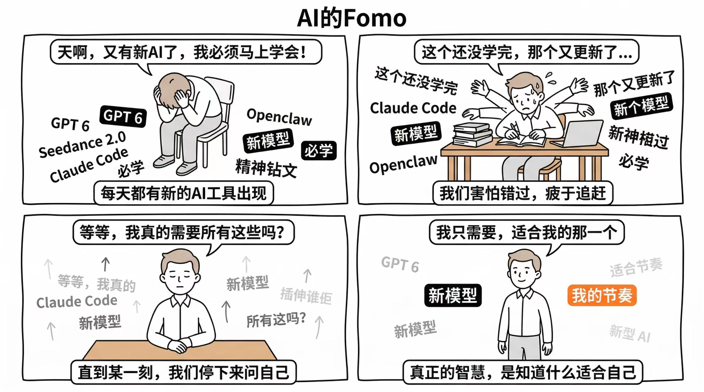
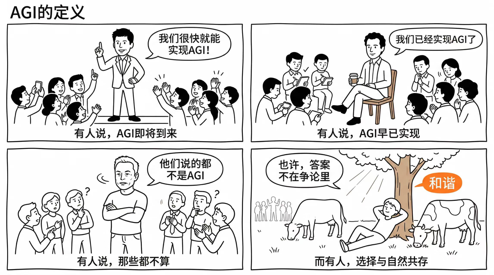

# 🎨 哲理四格漫画创作 | Philosophical Four-Panel Comic Creator

> Turn any idea into a thought-provoking 4-panel comic strip with clean minimalist line art.

## ✨ What It Does

This YouMind Skill transforms your ideas, philosophical concepts, or industry observations into **beautifully crafted 4-panel comic strips**. Each comic follows a classic narrative arc:

1. **问题呈现** — Present the problem / status quo
2. **矛盾升级** — Escalate the conflict
3. **转折觉醒** — The turning point / awakening
4. **升华智慧** — Sublimation / philosophical insight

## 🖼️ Style

- Clean minimalist line art (商务插画风格)
- Pure white background with black outlines
- Orange accent color for key labels (used sparingly)
- Hand-drawn aesthetic with slightly imperfect borders
- Simplified but well-proportioned characters (not stick figures)
- 2×2 grid layout, 16:9 aspect ratio

## 🚀 How to Use

### On YouMind (Recommended)

1. Go to [YouMind Skill Page](https://youmind.com/skills/RiAnaPXAmCmR5l)
2. Click **Install** to add to your workspace
3. Start a chat and describe your theme (e.g., "关于倾听的重要性" or "AI replacing jobs")
4. The Skill will:
   - Understand your theme
   - Create a 4-panel story
   - Generate the comic illustration
   - Ask for your feedback and iterate

### Theme Examples

- 🧠 Life philosophy: "停下来倾听", "放手的智慧", "比较与自我"
- 💼 Industry satire: "AI替代论的恐慌", "创业者的执念"
- 🌱 Growth mindset: "失败是最好的老师", "跳出舒适区"

## 📋 Skill Prompt

The full skill instructions are in [`SKILL.md`](SKILL.md).

## 🎬 Examples

| AI的Fomo | AGI的定义 |
|:---:|:---:|
|  |  |

## 🔧 Customization

After generation, you can:

- Modify the storyline
- Adjust character traits (gender, hairstyle, clothing)
- Change specific panel scenes or dialogue
- Switch viewing angles
- Add real people (e.g., Sam Altman, Elon Musk) or brand logos (ChatGPT, Claude, Gemini)
- Regenerate entirely

## 📄 License

[MIT](LICENSE)

## 👩‍💻 Author

**Nicole** — [YouMind](https://youmind.com) · Building tools for creators

---

*Made with ❤️ on [YouMind](https://youmind.com) — Learn smarter. Create bolder.*
